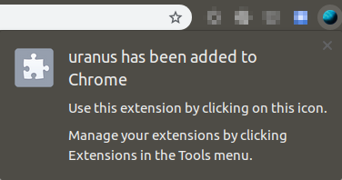

# uranus
An extension that replaces _Uranus_ with _Your anus_.

---

__Examples:__

---

To install, just drag and drop the `uranus.crx` file into `chrome://extensions` tab and click the "Add extension" button.

